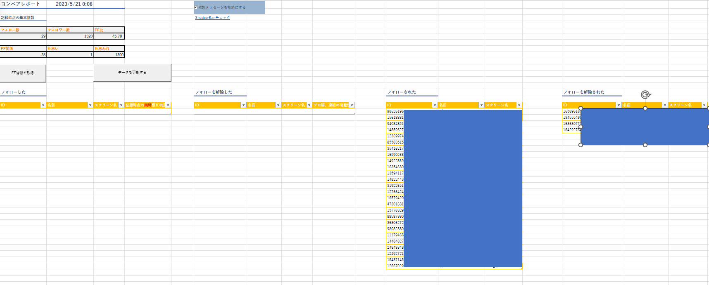
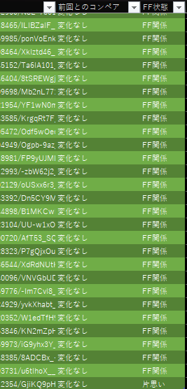
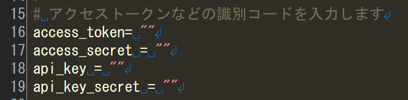
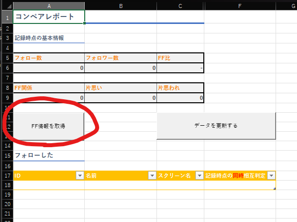
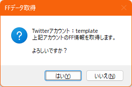
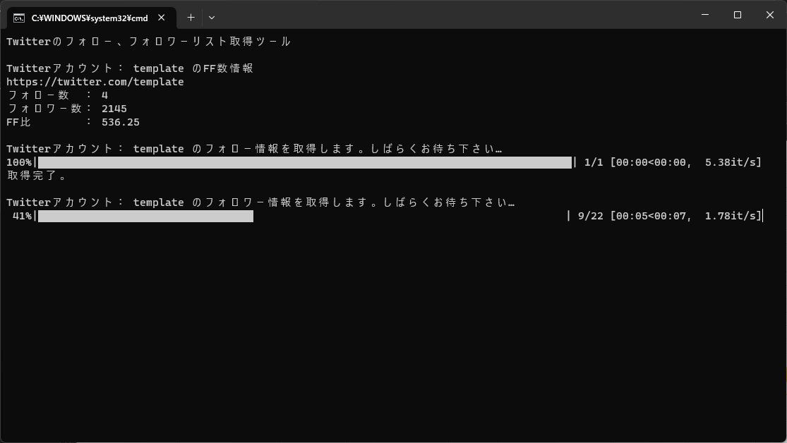

# Twitter-follower-management-tools

Excel(VBA) と Pythonのtweepyを利用して、Twitterのフォロー、フォロワー状況を管理するツールです。 
※画像はプライバシー保護のため、一部青塗りしてます。

ひとまず、以下の機能を提供します。

- 差分比較して、以下の状況を表示
  - フォローした
  - フォローを解除した
  - フォローされた
  - フォローを解除された

- テーブルのフィルター機能で、以下の状況を表示
  - 相互
  - 片思い
  - 片思われ 

Excelの知識があれば、もっと色んな情報が見れたりするかもしれません。 
ひとまずは、上記の機能を実装しました。
# 使用条件
Twitter API v1.1が廃止される日が過ぎてもまだ生きている方向けになります。 
自分もその一人で「なら、自分で作るか！」ということで生まれたツールです。 
あとは、Microsoft 365 Excelを購読してるのも条件です。

# 使用手順
## 1.ツールを使う前の準備
1. [Pythonをインストール](https://www.python.org/downloads/)
1. [tweepyをインストール](https://docs.tweepy.org/en/stable/install.html) 
~~~Python
pip install tweepy
~~~
## 2.Keyの編集

https://developer.twitter.com/en/portal/dashboard  
bat/ProgramPy/getFFinfo_API.py　にあるファイルを開き、上記のサイトから、識別コードを入力して保存してください。

## 3.同梱のマクロ付きExcelのファイル名を編集
ファイル名をTwitterのスクリーン名(@から始まる文字列)に変更して開いてください。 
これがFF情報を取得する対象アカウントになります。 
不本意な変更を防ぐためこのようにしました。

## 4.FF情報を取得する
 
赤丸部分を押下して、出てくる表示メッセージに問題ないか確認して、「はい」を押下するとデータ取得が始まります。

  

必要なソフトがインストール、設定がされていれば以下のように取得が開始されます。
 

あとは、メッセージウィンドウに従えば、データ取得とFF状況の変化を記録できると思います。

## License
[MIT License](License.txt)